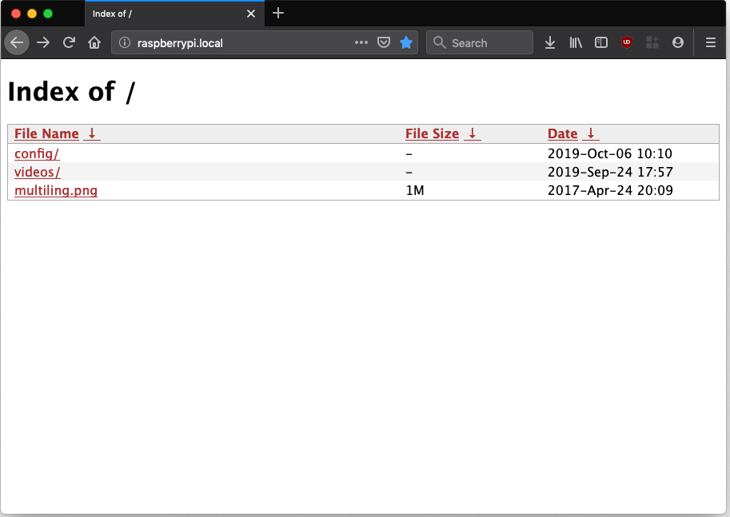
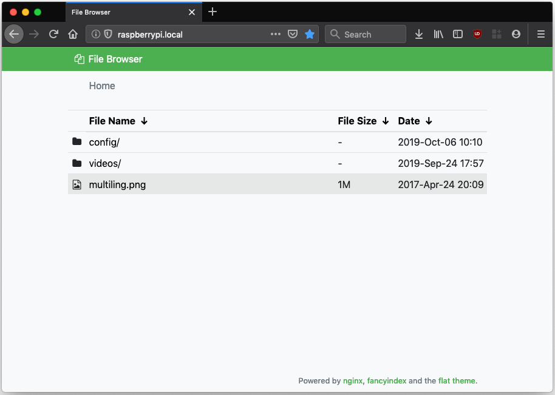

Title: Simple File / Media Server Using SMB and NGINX
Date: 5 Oct, 2019
Keywords: file server,media server,smb,samba,nginx,self hosted,raspberrypi,linux

We will create a simple file server on a GNU/Linux installation. The aim
is to have a bare-bones server that provides read-write access using the
SMB protocol (the technology that Microsoft uses for its network shares)
and (optionally) read-only access over HTTP, so that any device on the
network can fetch files or stream media while only needing a web
browser.

**Table of Contents**

<!-- TOC -->

- [Prerequisites](#prerequisites)
- [Samba](#samba)
    - [Creating the Media folder](#creating-the-media-folder)
    - [Installation](#installation)
    - [Configuration](#configuration)
    - [Creating a Samba user](#creating-a-samba-user)
    - [Applying Changes and Enabling the SMBD Service](#applying-changes-and-enabling-the-smbd-service)
    - [Accessing the Server](#accessing-the-server)
        - [Finding Out the Server Address](#finding-out-the-server-address)
        - [Using Windows](#using-windows)
        - [Using macOS](#using-macos)
- [Optional: Enabling Web/http Access Using NGINX](#optional-enabling-webhttp-access-using-nginx)
    - [Installation and Configuration](#installation-and-configuration)
        - [Serving the "/share" Directory](#serving-the-share-directory)
        - [Optional: Making Things Prettier](#optional-making-things-prettier)

<!-- /TOC -->

## Prerequisites

-   A computer running Debian or a derivative distribution such as
    Ubuntu or Raspbian (Raspberry Pi).
-   A way to connect said computer to the local network (WiFi/Ethernet).
-   Ample disk space to store your files.

## Samba

We will use [Samba](https://en.wikipedia.org/wiki/Samba_(software)) to provide file-sharing services to our devices. Before installing it, we will set up our folders.

### Creating the Media folder

First, create a new folder to serve as your media directory:

    sudo mkdir /share
    sudo chown username:username /share

In the second command, replace `username` with the username
you want to use on your system. If your username is `mark`, use
`mark:mark`. On Raspbian, you will probably want to use `pi:pi`.

### Installation

To begin, update your Apt repositories:

    sudo apt update

Then, install `Samba` using:

    sudo apt install samba samba-common-bin

### Configuration

Once installed, configure Samba to serve your files. To
do this, edit Samba's configuration file using your preferred editor:

    sudo nano /etc/samba/smb.conf

Add the following to this file:

    [share]
    path = /share
    writeable=Yes
    public=no
    create mask=0777
    directory mask=0777

Here, `[share]` refers to the name of the Samba share you created. This
share will be accessible from other machines on the address
`\\HOSTNAME\share`, where `HOSTNAME` is the actual hostname of your
server.

`path` defines the location of the shared directory on the filesystem.
Here, it refers to the directory you created earlier.

`writable` decides whether the folder is modifiable when accessed using
Samba.

`public` is set to **no**, which means that a
username and password will be required to access the share. If you wish to
enable anonymous, passwordless login, change it to **yes**.

Save the file. You are now ready to create a username and password for
accessing the share. Note that if you set up a public share using
`public=yes` in this step, you can skip the following section.

### Creating a Samba user

To create a username and password for accessing your share, use the
`smbpasswd` command. Replace `username` with the name that you wish to use:

    sudo smbpasswd -a username

After pressing **Enter**, you will be prompted to set a password for this user.

### Applying Changes and Enabling the SMBD Service

To apply your changes, first restart the `smbd` (Samba) service:

    sudo systemctl restart smbd

To make the service start up every time at boot, you need to *enable* it:

    sudo systemctl enable smbd

### Accessing the Server

To access the server using Samba, you need either the server's local IP
address, or the hostname. If you know what those are for your server,
you can jump to the [Using Windows](#using-windows) or [Using macOS](#using-macos) sections.

#### Finding Out the Server Address

Most modern routers let you access a device on the network using the
scheme `hostname.local`, where "hostname" is to be replaced by your
server's actual hostname. Usually, all you need to do to find that out
is to run the `hostname` command on the server:

    hostname

In my case, the output is "raspberrypi", since I'm using a
Raspberry Pi as the test device. I can ideally access my share using the
address `raspberrypi.local`.

If the above method does not work on your network, you will need the
local IP address of your server. Again, use the `hostname`
command, but with the `-I` flag, like so:

    hostname -I

You will get an address like `192.168.1.15` or `10.0.0.6`. Note it down.

#### Using Windows

Open up Windows Explorer. In the address bar, type in
`\\hostname.local\share`, replacing "hostname" with your server's
hostname (or `\\IP address\share` if that does not work). You will be
prompted to enter a username and password to access the share. Use the
credentials you set when creating the Samba user in the [Creating a Samba user](#creating-a-samba-user) section.

#### Using macOS

Open Finder. In the toolbar on the top, select
`Go->Connect to Server...`. In the address bar, type in
`smb://hostname.local/share`, replacing "hostname" with your server's
hostname (or `smb://IP address/share` if that does not work). You will
be prompted to enter a username and password to access the share. Use
the credentials you set when creating the Samba user in the [Creating a Samba user](#creating-a-samba-user) section.
You can choose to save the credentials and add this folder to your
Favorites for easier access in the future.

You are now all set to use your new file/media server as you please. Of
course, you can also access your server using your Android devices (look
for a file manager that supports the SMB/Samba protocol). iOS devices
can also access it using the built-in Files app.

That is it for the file server guide if all you need is SMB access. If you
would prefer to access your server using a web browser, keep reading.

## Optional: Enabling Web/http Access Using NGINX

To enable web access, you will need a web server. In this guide, we will use NGINX because it is relatively lightweight and simple to configure.

### Installation and Configuration

To install NGINX, run:

    sudo apt install nginx-full

To configure the server, first make sure that NGINX's "Fancy indexes" setting is enabled:

    file /etc/nginx/modules-enabled/50-mod-http-fancyindex.conf

If you get an output like `cannot open ...50-mod-http-fancyindex.conf (No such file or directory)`, enable the fancy indexes module by running:

    sudo ln -s /usr/share/nginx/modules-available/mod-http-fancyindex.conf /etc/nginx/modules-enabled/50-mod-http-fancyindex.conf

#### Serving the "/share" Directory

The config file for the default NGINX vhost is `/etc/nginx/sites-enabled/default`, which in turn is a symlink to `/etc/nginx/sites-available/default`.

    sudo nano /etc/nginx/sites-available/default

For our setup, replace its contents with the following:

    server {
    	# The default port to listen on
        listen 80 default_server;
    	listen [::]:80 default_server;
        
    	# Change root directory to our file server's root
    	root /share;
        
    	index index.html index.htm;
        
    	server_name _;
        
    	location / {
    		# First attempt to serve request as file, then
    		# as directory, then fall back to displaying a 404.
    		try_files $uri $uri/ =404;
        
            #Fancy index settings:
     		fancyindex on;              # Enable fancy indexes.
    		fancyindex_name_length 255; # Maximum length of a filename
    		fancyindex_localtime   on;
      		fancyindex_exact_size off;  # Output human-readable file sizes.
    	}
    }

Modify the `root` parameter according to your requirements if you chose a different directory for your file server.

Now, start and enable the NGINX service:

    sudo systemctl restart nginx
    sudo systemctl enable nginx

If everything went well, you can now access your server with any web browser at `http://hostname.local` - replacing "hostname" with your server's actual hostname or local IP address.

#### Optional: Making Things Prettier

If the above image looks rather... *dull* to you, that's because it is (it would've looked worse had we not enabled Fancy indexes). Fortunately, there are plenty of themes available for a prettier, more usable directory listing. For this guide, we will use one called [Flat theme](https://github.com/alehaa/nginx-fancyindex-flat-theme).

Download the theme to your home directory using:

    cd ~
    wget https://github.com/alehaa/nginx-fancyindex-flat-theme/releases/download/v1.0/nginx-fancyindex-flat-theme.tar.gz

Once the download is complete, unpack the tar archive:

    tar xvf ./nginx-fancyindex-flat-theme.tar.gz

You will now have a directory called `flat-theme` in your home folder. Move this to your server's root:

    mv ./flat-theme /share/theme

Next, modify the `/etc/nginx/sites-available/default` file:

    sudo nano /etc/nginx/sites-available/default

Scroll down to the `location / {` section in the file, and change it to this:

	    location / {
	        # First attempt to serve request as file, then
            # as directory, then fall back to displaying a 404.
            try_files $uri $uri/ =404;
        
            #Fancy index settings
            fancyindex on;              # Enable fancy indexes.
	        fancyindex_name_length 255;
            fancyindex_localtime   on;
            fancyindex_exact_size off;  # Output human-readable file sizes.
        
            # Settings for the theme:
            fancyindex_header      "/theme/header.html";
            fancyindex_footer      "/theme/footer.html";
            fancyindex_show_path   off;
        
            # Make sure the "theme" folder is not displayed:
            fancyindex_ignore "theme";
	    }

Finally, save the file and reload NGINX settings:

    sudo systemctl reload nginx

Refresh the page on your browser, and you will see a much better looking, more usable file index:

