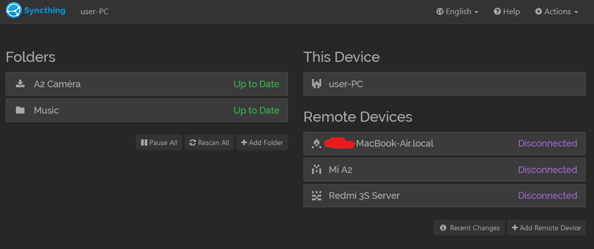
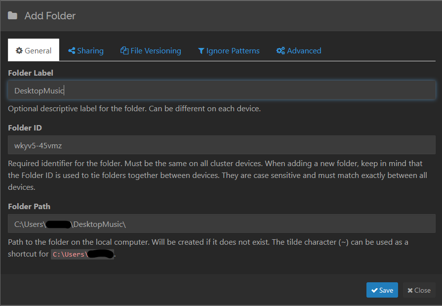
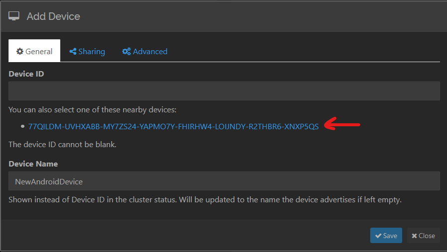
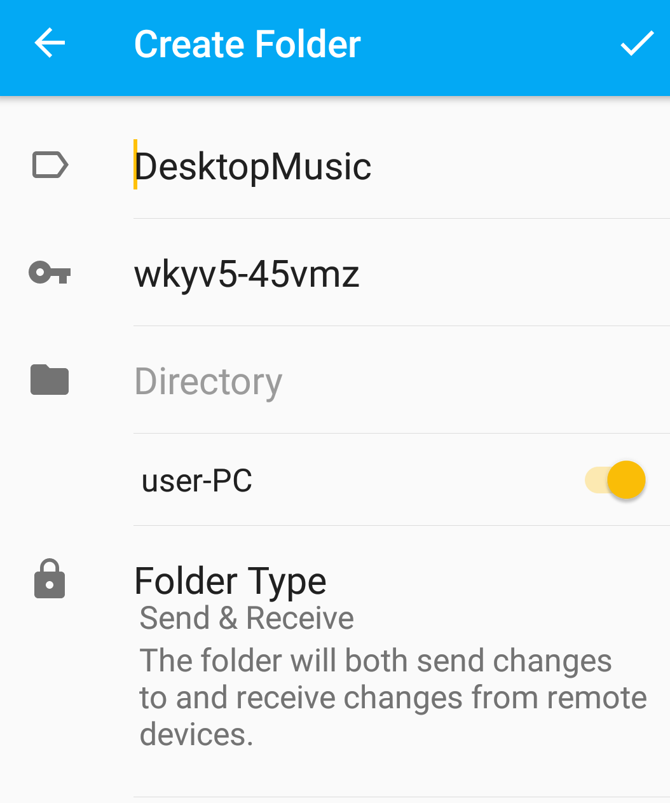
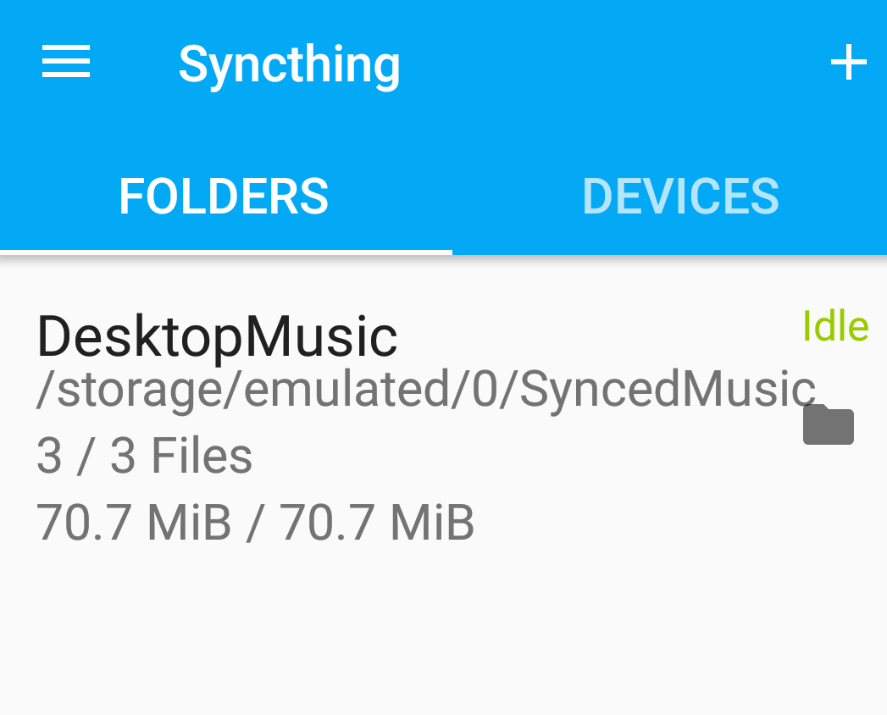
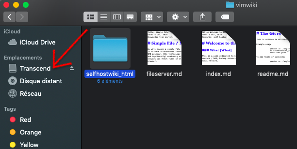

Title: Automated, Distributed File Syncing and Backups Using Syncthing and Rsync
Date: 18 Oct, 2019
Keywords: self hosted,raspberrypi,linux,syncthing,rsync,backups,file sync

In this guide, you will learn to use [Syncthing](https://syncthing.net/) for local, distributed file syncing across multiple devices, along with [Rsync](https://en.wikipedia.org/wiki/Rsync) (for macOS, Linux) and Windows' native backup utility for regularly backing up your important data.

The first goal is to have your important, frequently accessed data, such as music, camera photos etc. synced and available on all/most of your devices such as smartphones, laptops and desktops.

The second goal is to keep this synced, distributed data regularly backed up to an external storage device such as a pen/thumb drive or an external hard disk. This is important because while you do have your data in multiple places simultaneously, [**Syncthing is not a backup solution**](https://docs.syncthing.net/users/faq.html#is-syncthing-my-ideal-backup-application).

For example, if you are syncing your phone's "Camera photos" folder to your desktop, and some/all of the photos on the phone are accidentally deleted (or corrupted) while Syncthing is running on both the devices, it will notice the changes and happily delete the synced copies of those photos on your desktop as well.

Therefore, backups are essential.

**Table of Contents**
<!-- TOC -->

- [Distributed File Sync with Syncthing](#distributed-file-sync-with-syncthing)
    - [Download and install Syncthing for your OS:](#download-and-install-syncthing-for-your-os)
    - [Example Setup: Sharing a Music Folder Between an Android Phone and a Desktop/Laptop PC](#example-setup-sharing-a-music-folder-between-an-android-phone-and-a-desktoplaptop-pc)
    - [Sample Folder Structure](#sample-folder-structure)
- [Backups](#backups)
    - [Backups on Windows](#backups-on-windows)
        - [Using the GUI](#using-the-gui)
        - [Using the Command Line with Robocopy](#using-the-command-line-with-robocopy)
            - [Simplifying the Process](#simplifying-the-process)
    - [Backups on macOS and Linux with Rsync](#backups-on-macos-and-linux-with-rsync)
        - [Pre-Setup](#pre-setup)
        - [Taking Backups](#taking-backups)
        - [Creating a Backup Script](#creating-a-backup-script)
- [Further Reading](#further-reading)

<!-- /TOC -->

## Distributed File Sync with Syncthing

### Download and install Syncthing for your OS:

* [Android (Google play)](https://play.google.com/store/apps/details?id=com.nutomic.syncthingandroid), or alternatively, [F-Droid](https://f-droid.org/packages/com.nutomic.syncthingandroid/)
* [Windows](https://github.com/canton7/SyncTrayzor/releases/latest)
* [macOS](https://github.com/syncthing/syncthing-macos/releases/latest)
* Linux / BSD - use the version provided by your distribution (possibly old/outdated), or see the [Packages and Bundlings](https://docs.syncthing.net/users/contrib.html#packages-and-bundlings) document on the Syncthing website.

Install Syncthing on two or more of the devices that you want to sync folders on.

### Example Setup: Sharing a Music Folder Between an Android Phone and a Desktop/Laptop PC

As a demonstration, you will learn to set up a folder called "DesktopMusic" in your user's Home directory on a desktop to sync with a folder called "SyncedMusic" on an Android device. Once you can set this up, adding more folders and/or devices will be relatively straightforward.

1. On your desktop, create a folder called `DesktopMusic` in your user's Home directory.
1. On your Android smartphone, using a file manager of your choice, create a folder called `SyncedMusic`.
1. Run Syncthing on your desktop and open the Syncthing app on your smartphone. Make sure both the devices are connected to the same network.
1. On your desktop, you will see a screen like the following:

    Click on the "**+ Add Folder**" button on the left side of the screen.
1. In the dialog box that pops up, go to the "**Folder Path**" section and enter `~\DesktopMusic` if you are on Windows, or `~/DesktopMusic` on Linux/macOS. The `~` character automatically translates to your current user's Home directory.
    
    **Note for Linux/macOS users**: Keep in mind that these systems are *case-sensitive* - document1.txt is NOT the same as Document1.txt.

    
    As in the screenshot, give this folder an appropriate "Folder Label" and click "✅**Save**"

1. On the bottom right of the main screen, you will see a button called "**+Add Remote Device". Click it. Make sure Syncthing is open on your smartphone. You will see a popup like the following:

    The highlighted link is the device ID of your smartphone. Click on it to add it. Optionally, give the device a name in the "**Device Name**" section.
1. In the same dialog box, click on the "**Sharing**" tab on the top and make sure the `DesktopMusic` folder that we created is selected. Click "✅**Save**" once you are done. 

1. Soon, you will see a notification on your smartphone that says "Device XYZ wants to connect". Click on "**Accept**". After accepting, you will soon see another notification saying "Device XYZ wants to share folder 'DesktopMusic'". Click "**Accept**" again. You will see a screen similar to this:

1. Tap on the part where it says "**Directory**", and navigate to the `SyncedMusic` folder that you created earlier in point 2 and select it. Once done, tap on the ✅ tick button on the top right. If the `DesktopMusic` folder on your desktop has any files in it, they will sync with the smartphone.

That is all you need to know for basic file syncing with Syncthing. You can follow the same procedure to add more devices and folders to your setup. Ideally, you will keep the Syncthing service running perpetually on your desktop and run it on your mobile devices as and when necessary (Syncthing can be a battery hog).

For further reading and more advanced configurations, refer to the excellent [Syncthing documentation](https://docs.syncthing.net/). Of special interest are the concepts of [Send-only folder](https://docs.syncthing.net/users/foldertypes.html#send-only-folder) (for devices where "master copies" are kept) and [Receive-only folder](https://docs.syncthing.net/users/foldertypes.html#receive-only-folder).

### Sample Folder Structure

In a sample household with one desktop, one smartphone and one laptop, you can try to use a structure like this on your desktop:

    HOME/
    ├ Music      # Synced in Send-only mode with smartphone and laptop
    └ MobileStuff     # Parent folder for files synced from your smartphone
      ├ CameraPhotos   # Synced in Receive-only mode with smartphone
      ├ WhatsAppMedia  # Your phone's `/storage/Whatsapp/Media` folder,
                        # contains images,videos etc. shared on WhatsApp.
      └ Similarly, any other folders in your phone that you'd like to sync.

The advantage of a structure like this is that once your desktop or laptop has finished syncing with your smartphone, it is very easy to make backups of everything important, which we will learn in the next section.

## Backups

It is recommended to keep a copy of your important files on at least **two** external drives. One of them will be your daily backup drive - you insert it in your desktop or laptop once a day and make a backup. It will save your skin in case your computer's hard disk dies or if you accidentally delete your synced folders.

The other drive is your weekly/monthly backup - you do the same thing as the first one on it once per week/month, and then store it in a different location than your first backup drive. This will save your skin in case your first backup drive either fails or your baby throws it across the room.

### Backups on Windows

#### Using the GUI

Backing up your personal files in Windows is relatively straightforward using the built-in [Backup and Restore](https://support.microsoft.com/en-us/help/4027408/windows-10-backup-and-restore) functionality.

Insert your to-be backup drive in your computer, search for "**Backup Settings**" in the start menu, and use the GUI to configure which folders to back up, how often and to which drive. Do the same with your other backup drive, and you are done.

#### Using the Command Line with Robocopy

Another way to do backups on Windows if you need finer control of your backups and prefer using the command line is using the built-in Robocopy tool. While it is recommended to read the [dedicated tutorial](/robocopy.html) to get a good grasp of Robocopy, we will nevertheless see how to use it to back up your files to an external hard disk.

For the purpose of this tutorial, we will assume you have a directory structure as mentioned in the [Sample Folder Structure](#sample-folder-structure) section above, and want to back up the `Music` and `MobileStuff` folders in your home directory.

We are also assuming that your external drive is mounted as `H:\`. You will need to verify it on your system and change the drive letter accordingly. It is recommended to use a dedicated backup folder in your drive. In our case, we will use `H:\backups`.

Robocopy commands are structured like:

    robocopy <source> <destination> [<options>]

To sync the `MobileStuff` folder, open a PowerShell window, and enter the following command:

    robocopy ~\MobileStuff H:\backups\MobileStuff /s

Here is an explanation of what is going on:

* `~` is shortcut for your user's Home directory - `C:\Users\yourUsername` by default. Therefore, `~\MobileStuff` automatically translates to `C:\Users\yourUsername\MobileStuff`
* The `/s` option tells Robocopy to copy **s**ubdirectories when available.

Similarly, we can do the same for `Music` or any other folder:

    robocopy ~\Music H:\backups\Music /s

##### Simplifying the Process

If you have several folders that you wish to back up regularly, entering the above command for every folder will get tedious. To solve this problem, you can write a PowerShell `function`. Open a new PowerShell window, and enter the following command:

    notepad.exe $PROFILE

In the Notepad window that opens, add the following code and save the file:

    function backupMyFiles
    {
        robocopy C:\Users\yourUsername\MobileStuff H:\backups\MobileStuff /s
        robocopy C:\Users\yourUsername\Music H:\backups\Music /s
    }

In this code:
* `backupMyFiles` is the name of the function that you just created.
* The two commands between the curly braces are the commands that will run whenever you run `backupMyFiles` in a PowerShell window.
* Change `yourUsername` to whatever your actual username is.

Once you save the file, close and reopen PowerShell, running the command `backupMyFiles` will automatically backup the folders mentioned in the file. You can add whichever commands you like to this function, or change the name of the function to whatever you prefer. This takes out the tediousness and repetition involved in running the same set of commands for every folder that you want to back up.

### Backups on macOS and Linux with Rsync

>**Note**: If you are using macOS, it is recommended to use the excellent, intuitive [Time Machine](https://support.apple.com/en-us/HT201250) utility to manage your backups and call it a day. However, if you are hardcore and wish to control every single aspect of your backups (or if you just prefer the command line), then continue reading.

[Rsync](https://en.wikipedia.org/wiki/Rsync) is a command-line utility for synchronizing files and folders between disks and (optionally) across the network. It comes preinstalled on macOS and most Linux distributions, so there is no need to install additional software.

These instructions assume you have set up your folders according to the [sample folder structure]. If not, make sure to substitute accordingly. Again, pay attention to the *case* when working on the command line - `document1.txt` is NOT the same as `Document1.txt`.

#### Pre-Setup

> **Note for Linux users**: Different Linux distributions and flavors have different ways to mount external drives and use different directories as mount points. Please refer to your distribution's documentation to know where external disks are mounted. Other than this detail, the rest of the documentation applies equally to macOS and Linux.

Insert your external hard disk and open Finder. Make a note of what the drive is called. In my case, it is called `Transcend`:

Navigate to the disk and create a folder called `backups`. This will be the folder in which you will back up your data.

Your external disk is mounted in a folder called `/Volumes`. To locate it, open Terminal, type in the command `ls /Volumes` and press Enter/Return. You will see an output like the following:

    $ ls /Volumes
    Macintosh HD	Preboot		Transcend

As noted earlier, my external disk is called `Transcend`. Therefore, we infer from this command that it is mounted under `/Volumes/Transcend`. Make a note of this path. Again, case matters.

Use the `mkdir` (make directory) command to create a `backups` directory in the external drive:

    mkdir /Volumes/Transcend/backups

#### Taking Backups

Rsync commands are structured like:

    rsync [<options>] <source> <destination>

As a sample backup plan, here is how to back up the `MobileStuff` directory:

    rsync -avu --progress --modify-window=1 ~/MobileStuff /Volumes/Transcend/backups

Here is an explanation of what is going on in the above command:

* The `-avu` option has three parts:
    * The `a` option tells Rsync to sync in "archive" mode.
    * The `v` option increases verbosity and gives more details on what is going on during the transfer.
    * `u` tells Rsync to skip any files that already exist on the destination during subsequent backups. However, if the file has been modified at the source, the destination file will be replaced with the newer version.
* `--progress` shows progress during transfer.
* `~` stands for your user's Home directory. `/Users/<your username>` on macOS, and `/home/<your username>` on Linux.
* `/Volumes/Transcend/backups` is the directory that the files will be synced to. The "Transcend" part will probably be different on your system. Substitute accordingly.
* `--modify-window=1` is a special parameter that you need to pass if you are syncing from a macOS/Linux system to an external drive formatted in Microsoft's [FAT filesystem family](https://en.wikipedia.org/wiki/File_Allocation_Table). Most flash drives are formatted in this filesystem by default. If you are certain that your external drive does not use this filesystem, you can omit this parameter. If you are not certain, leave it in.

This will create a folder called `MobileStuff` in the destination folder `/Volumes/Transcend/backups` and sync it with the source folder. Any time you modify or add files to the source folder and rerun the above command, it will sync all the latest changes.

Similarly, you can sync other directories:

    rsync -avu --progress --modify-window=1 ~/Music /Volumes/Transcend/backups

#### Creating a Backup Script

Instead of running the (rather lengthy) Rsync command(s) every time you want to do a backup, you can instead create a *script* to simplify the process. In a Terminal window, create a directory called `bin`:

    mkdir ~/bin

In the newly created folder, using a text editor of your choice, create a file called `backup.sh` and add all the commands that you want to run. For example:

    rsync -avu --progress --modify-window=1 ~/MobileStuff /Volumes/Transcend/backups
    rsync -avu --progress --modify-window=1 ~/Music /Volumes/Transcend/backups
    rsync -avu --progress --modify-window=1 ~/Documents/SuperImportantDocs /Volumes/Transcend/backups

Save the file and make it executable using the [`chmod`](https://en.wikipedia.org/wiki/Chmod) command:

    chmod +x ~/bin/backup.sh

Add the `~/bin` directory to your PATH by editing your `.bash_profile` using your preferred text editor. For example:

    nano ~/.bash_profile

Append the following line to this file and save it:

    export PATH=$PATH:$HOME/bin

Close the terminal window and open a new one. Now, any time you run `backup.sh` in a Terminal, it will run all the commands you just saved, one after the other.

## Further Reading

* [Syncthing Documentation](https://docs.syncthing.net/)
* [Robocopy on Microsoft Docs](https://docs.microsoft.com/en-us/windows-server/administration/windows-commands/robocopy)
* [Rsync Manual Page](https://download.samba.org/pub/rsync/rsync.html)