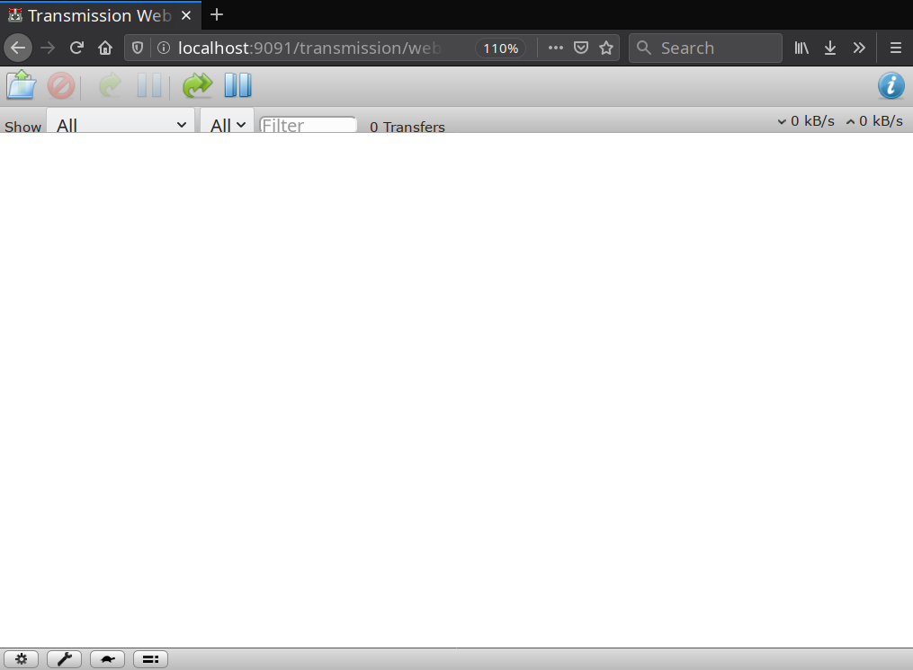
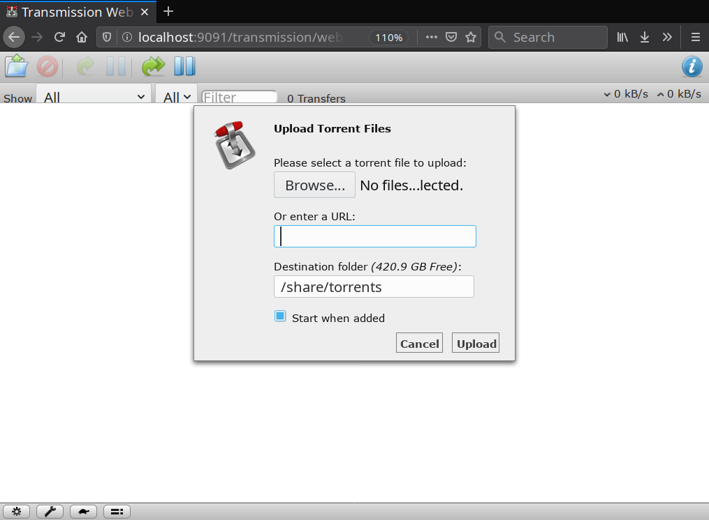
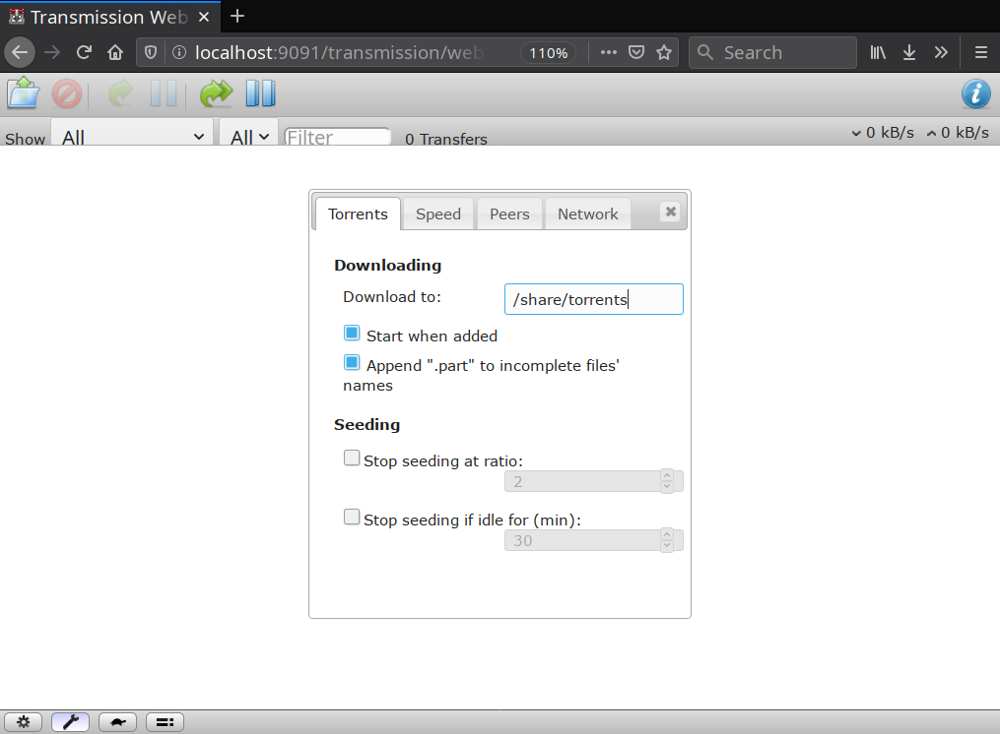
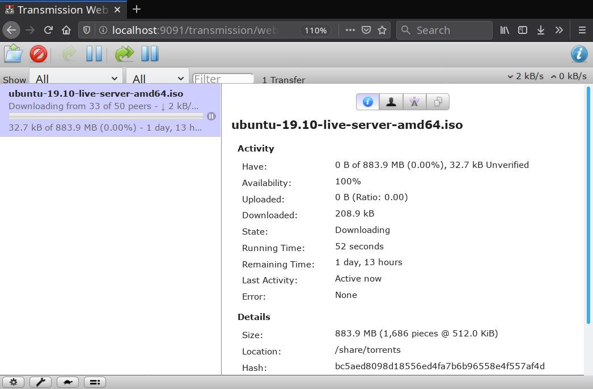

Title: Simple Torrent Box Using Transmission-daemon
Date: 6 Nov, 2019
Keywords: self hosted,raspberrypi,linux,transmission,file server,media server,bittorrent

In this article, you will learn how to make a *Torrent Box* - a computer dedicated to downloading and seeding torrent files. Ideally, this will be a low-powered computer that stays on most or all of the time, such as an [Intel NUC](https://en.wikipedia.org/wiki/Next_Unit_of_Computing) or a Raspberry Pi. However, you can use practically any computer for this purpose.

By the end of this guide, you will have a torrent box that you can control (add/remove torrents, limit bandwidth etc) and copy files or stream media from any device on your local network. For the file sharing and streaming to work, it is recommended to follow and set up file-sharing using the [Simple File / Media Server guide](fileserver.html) beforehand.

**Table of Contents:**

<!-- TOC -->

- [Prerequisites and Assumptions](#prerequisites-and-assumptions)
- [Installing Transmission Daemon](#installing-transmission-daemon)
- [Creating the Downloads Folder](#creating-the-downloads-folder)
- [Configuring Transmission](#configuring-transmission)
    - [Optional:  Watching a Directory for Torrents](#optional--watching-a-directory-for-torrents)
    - [Final Steps](#final-steps)
- [Accessing the Web Interface](#accessing-the-web-interface)
    - [Mobile and Desktop Apps](#mobile-and-desktop-apps)
- [Final Thoughts and Further Reading](#final-thoughts-and-further-reading)

<!-- /TOC -->

## Prerequisites and Assumptions
- A computer running a recent version of Debian, Raspbian or Ubuntu.
- A way to connect said computer to the local network and the internet (Wifi/Ethernet).
- Plenty of disk space to store your downloaded files in.

This guide assumes that you have read and set up file sharing on this computer as described in the [Simple File / Media Server guide](fileserver.html). If you don't, the torrenting part will still work, but you will not be able to access the downloaded files over the network. You can skip that guide if you have another way to transfer the downloaded files to your other devices.

For the sake of consistency, it is assumed that this is being set up on a Raspberry Pi running Raspbian, with the username `pi`.

## Installing Transmission Daemon

[Transmission](https://transmissionbt.com/) is a lightweight, multi-platform torrent client. It can be used like a regular torrent client with a GUI like Deluge or qBittorrent. However, for a torrent box that you can control remotely, you will need the Transmission *daemon*, which is a service that runs in the background and can be controlled remotely. To install Tramission daemon, run the following commands in a Terminal window:

    sudo apt update
    sudo apt install transmission-daemon

Before we configure anything, it is important to know that whenever you make any changes to the Transmission configuration file, you have to *stop the Transmission daemon beforehand*, otherwise Transmission will lose the changes you made and overwrite the file with the previous configuration. To prevent this from happening, stop the daemon *before* configuring anything:

    sudo systemctl stop transmission-daemon

## Creating the Downloads Folder

Before we begin the configuration, we will create a folder for Transmission to save downloaded files in. If you have been following the [Simple File / Media Server guide](fileserver.html), you will already have a folder called `/share` that is owned by your user. Now create a folder called `/share/torrents` owned by the (automatically created) `debian-transmission` user and group. Despite what the name suggests, this user is created even if you are using Ubuntu.

    sudo mkdir -p /share/torrents
    sudo chown debian-transmission:debian-transmission /share/torrents

## Configuring Transmission

The main configuration file is located in `/etc/transmission-daemon/settings.json`. As mentioned before, it is necessary to *stop* the Transmission daemon before you edit this file. Have a look at the configuration file by opening it with your preferred text editor. Most of the configuration parameters are self explanatory:

    sudo nano /etc/transmission-daemon/settings.json

>If you do not yet know how to use the `nano` text editor, please refer to [this Gentoo Wiki article](https://wiki.gentoo.org/wiki/Nano/Basics_Guide).

Here are the parameters that you should change in the configuration file. Just look for them (all the parameters are ordered alphabetically by default) and make modifications as necessary. Please pay attention to the quotes and commas. They are mandatory and should be copied as-is:

    "download-dir": "/share/torrents",
    "rpc-username": "transmission",
    "rpc-password": "ChooseAStrongPassword",
    "rpc-whitelist": "127.0.0.1,192.168.*.*",
    "umask": 0,

Here is what these parameters mean:

- `download-dir` refers to the directory that the files should be downloaded in.
- `rpc-username` is the username that will be used to login to the Transmission web interface.
- `rpc-password` is the password that will be used for above username. Choose a strong password in this field. It will be rewritten to a hashed version after you restart Transmission daemon for security reasons.
- `rpc-whitelist` is a list of IP addressed that can access the Transmission web interface. In this case, it is `127.0.0.1`, i.e., the machine that the daemon is running on, `192.168.*.*`, which would include the devices connected to your local network.
- `umask` is set to `0`, which means that the downloaded files will be readable and writable by users other than `debian-transmission`, the Transmission daemon's default user.

### Optional:  Watching a Directory for Torrents

If you wish to have torrents automatically start downloading by adding `*.torrent` files to a certain directory, you can use the `watch-dir` family of directives. Modify the values in the `settings.json` file to the following:

    "watch-dir-enabled": 1,
    "watch-dir": "/share/torrents/watch",

You will also need to create the directory and give your user appropriate permissions:

    sudo mkdir /share/torrents/watch
    sudo chown pi:pi /share/torrents/watch

**Note**: This guide is written assuming Raspbian OS, and you should replace `pi:pi` with your actual username and group, for example, `mark:mark`.

### Final Steps

After you have configured Transmission to your liking, it is time to restart the daemon and enable it so that it starts at every boot:

    sudo systemctl start transmission-daemon
    sudo systemctl enable transmission-daemon

## Accessing the Web Interface

To access the web interface, you first need to know the local IP address of the machine that Transmission daemon is running on. To do this, run the `hostname` command on the machine, like so:

    hostname -I

You will get an address like `192.168.1.15` in the output. This is the local IP address of your torrent box. Note it down.

The web interface runs on port **9091** by default. To access it, open a web browser, and enter the IP address of your torrent box, followed by `:9091`. For example, if the IP address is `192.168.1.15`, then enter `192.168.1.15:9091` in the address bar and hit *Enter*. You will see a screen like the following:

While not the prettiest of interfaces, this screen is functional and lets you add torrents:

Change settings (by clicking the wrench icon in the bottom left) such as the default download path, download/upload speeds:

Once you have added torrents, you can also view and change per-torrent settings such as download speed, or choosing which files to download by selecting a torrent and clicking on the large, blue "i" button on the top right:

### Mobile and Desktop Apps

If you would rather access your torrent box using a native app rather than a web browser, here is a list of apps. In most cases, you only need to provide the server's local IP address and the port that Transmission daemon is running on (9091 by default).

- Desktop - [Transmission Remote GUI](https://github.com/transmission-remote-gui/transgui) (Windows, Linux, macOS)
- Android:
    - Tremotesf [F-Droid](https://f-droid.org/en/packages/org.equeim.tremotesf/), [Play Store](https://play.google.com/store/apps/details?id=org.equeim.tremotesf)
    - [Transmission Remote](https://play.google.com/store/apps/details?id=net.yupol.transmissionremote.app)
    - [Transdroid](https://www.transdroid.org/)

## Final Thoughts and Further Reading

This is all you need to know for basic usage of the Transmission daemon and web interface. The configuration file and the web interface are relatively simple to understand and manipulate. Here is a list of helpful web pages to help you learn more about this setup:

- [Transmission Wiki on GitHub](https://github.com/transmission/transmission/wiki)
- [Configuration File Reference on Transmission Wiki](https://github.com/transmission/transmission/wiki/Editing-Configuration-Files)
- [Ubuntu Wiki Article](https://help.ubuntu.com/community/TransmissionHowTo) (slightly outdated, but still contains useful information)
- [Simple File / Media Server Guide](fileserver.html) - The guide that this tutorial is based on. Contains useful information on how to share files and stream media across your local network.
- [Distributed File Syncing and Backups Guide](sync_backup.html) - A useful resource if you want to automatically sync your downloaded files to your devices rather than accessing them through the server.

    Tip: If you are going to use Syncthing to sync the downloaded files, change `"incomplete-dir-enabled": false,` to `"incomplete-dir-enabled": true,` and choose a folder outside of `/share` in the `"incomplete-dir":` parameter in `settings.json`. This is to ensure that Syncthing only syncs the completed files in `/share/torrents` rather than inefficiently transferring incomplete torrent downloads.